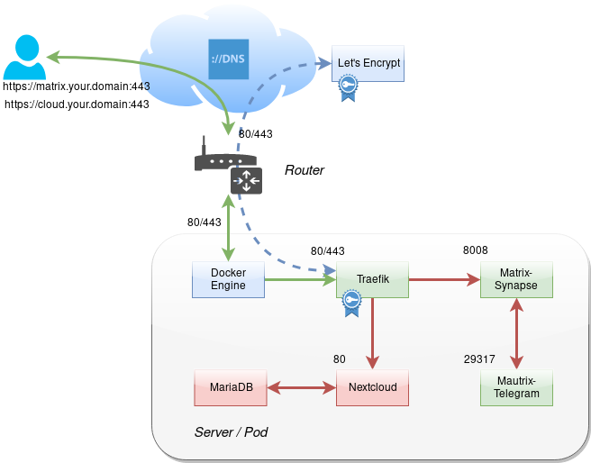

# liberty-server

Free yourself from the big cloud providers and run your own cloud services. This repository aims to help you to quickly set up and run a dockerized homeserver with Nextcloud and other free apps.



## About

Liberty Server is a set of Docker setup files helping you to set up your own nextcloud server with Docker on Linux.

## Getting Started

Go to each `docker-compose.yaml` file and update instance specific configuration such as TLD and external storage directories for example.

Manually create the necessary docker networks

```
$ docker network create webproxy
$ docker network create traefik_proxy
$ docker network create nextcloud_backend
```

Start the server adding additional free apps optionally

```
$ docker-compose \
    -f traefik2/docker-compose.yaml \
    -f nextcloud/docker-compose.yaml \
    -f database/docker-compose.yaml \
    up -d
```

Stop the server

```
$ docker-compose \
    -f traefik2/docker-compose.yaml \
    -f nextcloud/docker-compose.yaml \
    -f database/docker-compose.yaml \
    down
```
